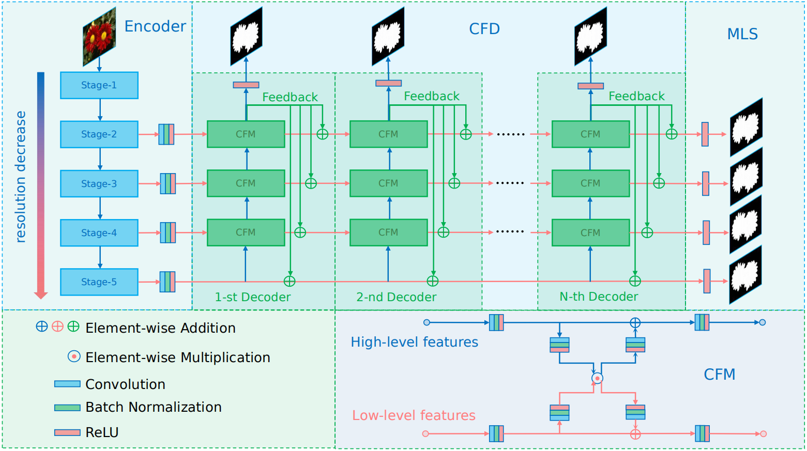
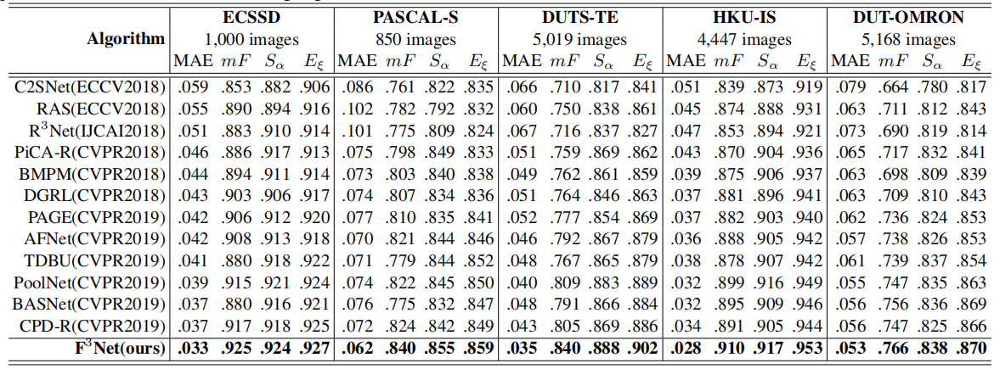
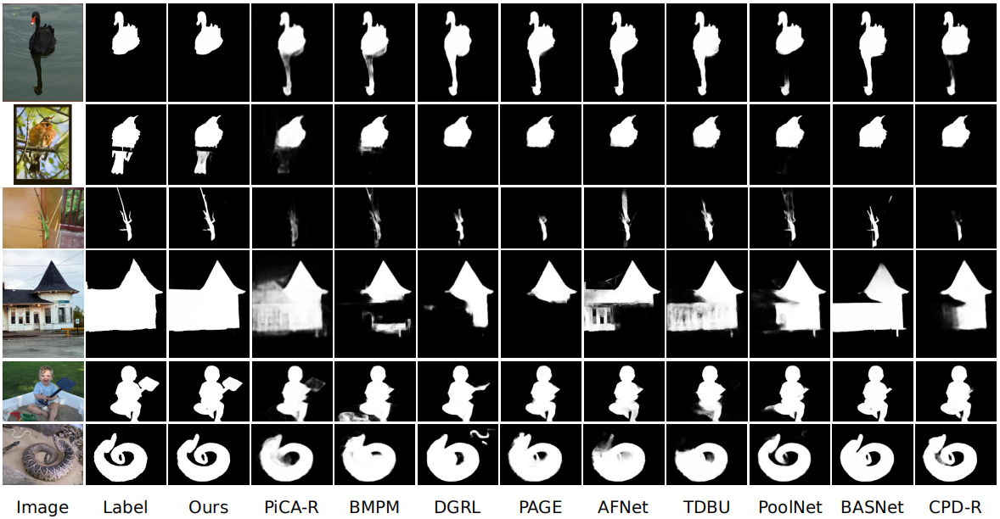

## [F3Net: Fusion, Feedback and Focus for Salient Object Detection](https://arxiv.org/pdf/1911.11445.pdf)
by Jun Wei, Shuhui Wang, Qingming Huang

## Introduction
Most of existing salient object detection models have achieved great progress by aggregating multi-level features extracted from convolutional neural networks. However, because of the different receptive fields of different convolutional layers, there exists big differences between features generated by these layers. Common feature fusion strategies (addition or concatenation) ignore these differences and may cause suboptimal solutions. In this paper, we propose the F3Net to solve above problem, which mainly consists of cross feature module (CFM) and cascaded feedback decoder (CFD) trained by minimizing a new pixel position aware loss (PPA). Specifically, CFM aims to selectively aggregate multi-level features. Different from addition and concatenation, CFM adaptively selects complementary components from input features before fusion, which can effectively avoid introducing too much redundant information that may destroy the original features. Besides, CFD adopts a multi-stage feedback mechanism, where features closed to supervision will be introduced to the output of previous layers to supplement them and eliminate the differences between features. These refined features will go through multiple similar iterations before generating the final saliency maps. Furthermore, different from binary cross entropy, the proposed PPA loss doesn’t treat pixels equally, which can synthesize the local structure information of a pixel to guide the network to focus more on local details. Hard pixels from boundaries or error-prone parts will be given more attention to emphasize their importance. F3Net is able to segment salient object regions accurately and provide clear local details. Comprehensive experiments on five benchmark datasets demonstrate that F3Net outperforms state-of-the-art approaches on six evaluation metrics.


## Prerequisites
- [Python 3.5](https://www.python.org/)
- [Pytorch 1.3](http://pytorch.org/)
- [OpenCV 4.0](https://opencv.org/)
- [Numpy 1.15](https://numpy.org/)
- [TensorboardX](https://github.com/lanpa/tensorboardX)
- [Apex](https://github.com/NVIDIA/apex)


## Clone repository

```shell
git clone git@github.com:weijun88/F3Net.git
cd F3Net/
```

## Download dataset

Download the following datasets and unzip them into `data` folder

- [PASCAL-S](http://cbi.gatech.edu/salobj/)
- [ECSSD](http://www.cse.cuhk.edu.hk/leojia/projects/hsaliency/dataset.html)
- [HKU-IS](https://i.cs.hku.hk/~gbli/deep_saliency.html)
- [DUT-OMRON](http://saliencydetection.net/dut-omron/)
- [DUTS](http://saliencydetection.net/duts/)

## Download model

- If you want to test the performance of F3Net, please download the [model](https://drive.google.com/open?id=1zKogcTuA9JA5v7PfnArVyTPTaOw1ZqDG) into `out` folder
- If you want to train your own model, please download the [pretrained model]('https://download.pytorch.org/models/resnet50-19c8e357.pth') into `res` folder

## Training

```shell
    cd src/
    python3 train.py
```
- `ResNet-50` is used as the backbone of F3Net and `DUTS-TR` is used to train the model
- `batch=32`, `lr=0.05`, `momen=0.9`, `decay=5e-4`, `epoch=32`
- Warm-up and linear decay strategies are used to change the learning rate `lr`
- After training, the result models will be saved in `out` folder

## Testing

```shell
    cd src
    python3 test.py
```
- After testing, saliency maps of `PASCAL-S`, `ECSSD`, `HKU-IS`, `DUT-OMRON`, `DUTS-TE` will be saved in `eval/F3Net/` folder.

## Saliency maps & Trained model
- [saliency maps](https://drive.google.com/file/d/1FfZtzfSX6-hlwar4yJYLuGogGbLW9sYe/view?usp=sharing)
- [trained model](https://drive.google.com/file/d/1jcsmxZHL6DGwDplLp93H4VeN2ZjqBsOF/view?usp=sharing)


## Evaluation
- To evaluate the performace of F3Net, please use MATLAB to run `main.m`
```shell
    cd eval
    matlab
    main
```
- Quantitative comparisons 


- Qualitative comparisons 


## Citation
- If you find this work is helpful, please cite our paper
```shell
@inproceedings{F3Net,
  title     = {F3Net: Fusion, Feedback and Focus for Salient Object Detection},
  author    = {Jun Wei, Shuhui Wang, Qingming Huang},
  booktitle = {AAAI Conference on Artificial Intelligence (AAAI)},
  year      = {2020}
}
```